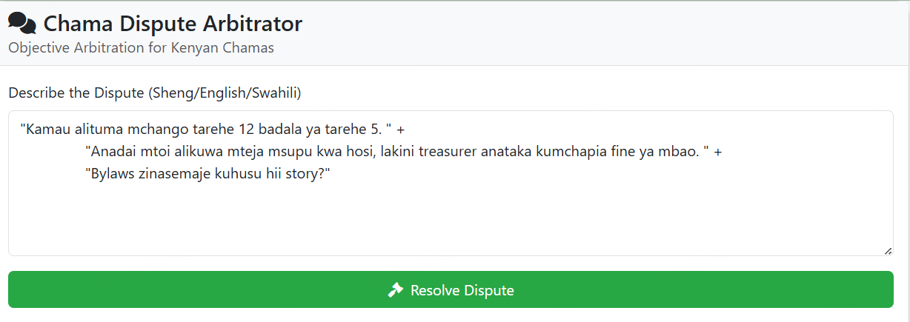
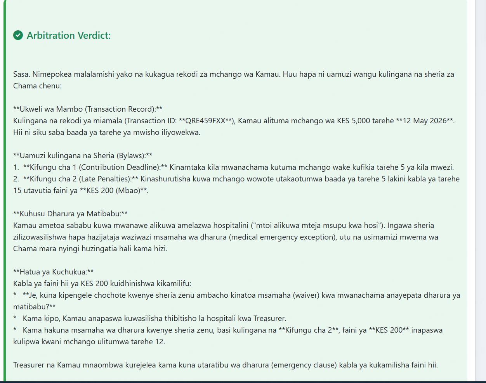

# Chama Agent Connect

## Problem Statement

In many community groups or informal financial organizations (like "Chamas" in Kenya), disputes and disagreements can arise among members. These conflicts often stem from misunderstandings of bylaws, financial transactions, or personal differences. Resolving these issues efficiently and fairly is crucial for maintaining group cohesion and trust. This project aims to provide an AI-powered "Mpatanishi" (mediator/arbitrator) agent that can help members understand their bylaws, clarify transaction details, and facilitate fair resolutions, thereby reducing friction and promoting harmony within the group.

## Agent Architecture

The Chama Agent Connect application is built around a central AI agent, the `ChamaArbitratorAgent`, which leverages the LangChain4j framework.

*   **`ChamaArbitratorAgent`**: This is the core AI agent responsible for mediating disputes and providing information. It's an `AiService` that orchestrates interactions with various tools and knowledge bases.
    *   **Language Model**: Powered by **Google Gemini 1.5 Flash**, providing conversational capabilities and reasoning.
    *   **Chat Memory**: Uses `MessageWindowChatMemory` to maintain context across a conversation, remembering the last 10 messages.
    *   **Tools**:
        *   **`MpesaTransactionTool`**: This tool simulates access to Mpesa transaction data. When a user asks about a transaction, the agent can invoke this tool to retrieve relevant (simulated) financial records.
    *   **Content Retriever (RAG - Retrieval Augmented Generation)**:
        *   **Knowledge Base**: The agent is augmented with a knowledge base derived from the `bylaws.txt` document.
        *   **Embedding Model**: `AllMiniLmL6V2QuantizedEmbeddingModel` is used to convert the bylaws text into numerical embeddings.
        *   **Embedding Store**: An `InMemoryEmbeddingStore` stores these embeddings.
        *   **Content Retrieval**: When a user asks a question related to bylaws, the `EmbeddingStoreContentRetriever` fetches relevant sections of the bylaws to provide context to the language model, ensuring accurate and context-aware responses.

**Communication Flow:**

1.  User input is received by the Spring Boot backend.
2.  The `ChamaArbitratorAgent` processes the input.
3.  Based on the user's query, the agent decides whether to:
    *   Consult its `ChatMemory` for conversational context.
    *   Invoke the `MpesaTransactionTool` for financial data.
    *   Query the `ContentRetriever` to fetch relevant bylaws.
    *   Directly respond using its general knowledge from the Gemini model.
4.  The agent formulates a response, potentially combining information from multiple sources.
5.  The response is sent back to the user via the web interface.

## How to Run Locally

To run the Chama Agent Connect application on your local machine, follow these steps:

1.  **Prerequisites**:
    *   Java Development Kit (JDK) 17 or higher
    *   Maven
    *   A Google AI API Key (for Gemini model access)

2.  **Clone the Repository**:
    ```bash
    git clone https://github.com/JoshuaMusyoki/Chama_AngentCon.git
    cd Chama_AngentCon
    ```
3.  **Set up Google AI API Key**:
    The application expects the Google AI API Key to be set as an environment variable.
    *   **Linux/macOS**:
        ```bash
        export GOOGLE_AI_API_KEY="YOUR_GOOGLE_AI_API_KEY"
        ```
    *   **Windows (Command Prompt)**:
        ```bash
        set GOOGLE_AI_API_KEY="YOUR_GOOGLE_AI_API_KEY"
        ```
    *   **Windows (PowerShell)**:
        ```powershell
        $env:GOOGLE_AI_API_KEY="YOUR_GOOGLE_AI_API_KEY"
        ```
    Replace `"YOUR_GOOGLE_AI_API_KEY"` with your actual API key obtained from Google AI Studio.

4.  **Build the Application**:
    ```bash
    mvn clean install
    ```

5.  **Run the Application**:
    ```bash
    java -jar target/Chama_AngentCon-1.0-SNAPSHOT.jar
    ```

6.  **Access the Application**:
    Open your web browser and navigate to `http://localhost:8080`. The frontend `index.html` will be served, and you can interact with the agent.

## How to Interact with the Deployed Version

The application is deployed to Google Cloud Run for the backend API and Firebase Hosting for the static web frontend.

1.  **Access the Web Interface**:
    Navigate to the deployed Firebase Hosting URL (e.g., `https://your-project-id.web.app`).

2.  **Interact with the Agent**:
    Use the chat interface to ask questions related to Chama bylaws or simulated Mpesa transactions.

    *   **Example Bylaw Questions**:
        *   "What are the rules for member contributions?"
        *   "How can a member withdraw from the Chama?"
        *   "What happens if a member defaults on a loan?"

    *   **Example Transaction Questions (simulated)**:
        *   "What is John Doe's balance?"
        *   "How much did Jane Smith contribute last month?"
        *   "Show me the transactions for member ID 123."

## Screenshots or Demo Video






## Data Handling and Political Neutrality Policy

*(This section is crucial for Challenge 06. Please detail your policy here.)*

**Data Handling:**
*   **Input Data**: Describe what kind of data the agent receives (e.g., user queries, simulated transaction data).
*   **Data Storage**: Explain if any user data or conversation history is stored, where it's stored, for how long, and why. For this project, `InMemoryEmbeddingStore` and `MessageWindowChatMemory` mean data is ephemeral and not persistently stored across sessions or restarts.
*   **Privacy**: How is user privacy protected?
*   **Bylaws Data**: The `bylaws.txt` is static and part of the application's knowledge base.

**Political Neutrality Policy:**
*   **Impartiality**: The agent is designed to act as an impartial mediator, relying on the provided bylaws and simulated transaction data. It does not express personal opinions or biases.
*   **Fact-Based Responses**: Responses are generated based on the factual content of the bylaws and the logic embedded in the `MpesaTransactionTool`.
*   **Conflict Resolution Focus**: The primary goal is to facilitate understanding and resolution of conflicts within the defined scope of the Chama's rules.
*   **Limitations**: Acknowledge that while the agent strives for neutrality, it is limited by the data it's trained on and the rules it's given. Complex ethical or deeply personal disputes might require human intervention.
